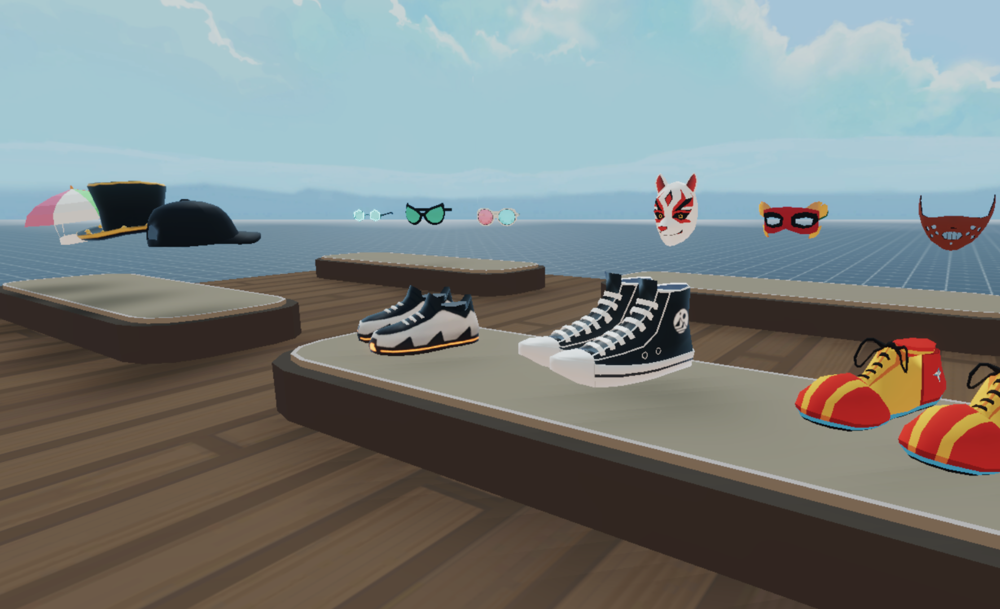

# Wearables Marketplace

A simple scene that uses the `decentraland-crypto-utils` library and the Marketplace API mount an in-world wearables shop for wearables that are on Layer 1 Ethereum, leveraging from items published in the Decentraland Marketplace.



> Note: This example code only works for wearables on L1 of Ethereum. It doesn't work for wearables on L2. For that, refer to the [Wearables Store](https://github.com/decentraland-scenes/wearables-store) example scene.

This scene shows you:

- How to use the crypto utils library
- How to query the Marketplace API (based on The Graph)
- How to check if a player has allowed a dapp to handle MANA on their behalf and if the player has balance
- How to run a buy transaction from the scene, to trade MANA for a wearable
- How to build a UI to display all the data for a wearable publication
- How to open a custom UI to display a confirmation prompt
- How to make a UI component clickable and use it to trigger functions

The crypto Utils function makes it a lot simpler to perform blockchain functions. Sending MANA from one account to another just takes one line of code using this library.

Feel free to reuse the models and code from this scene!

> Note: The crtpyo-utils library is currently a work in progress and has issues that need to be resolved. It's not yet published on npm, but you can copy what's been done in the `package.json` file of this repository.

## Try it out

**Install the CLI**

Download and install the Decentraland CLI by running the following command:

```bash
npm i -g decentraland
```

**Previewing the scene**

Download this example and navigate to its directory, then run:

```
$:  dcl start
```

Any dependencies are installed and then the CLI opens the scene in a new browser tab.

Paste the following to the end of the URL in the browser window:

`&ENABLE_WEB3`
For example, if the URL is http://127.0.0.1:8000?position=0%2C0&SCENE_DEBUG_PANEL, make it http://127.0.0.1:8000?position=0%2C0&SCENE_DEBUG_PANEL&ENABLE_WEB3

> Note: When running a preview of a scene that uses one of the ethereum libraries, you must have Metamask or Dapper open and you must add this string.

Learn more about how to build your own scenes in our [documentation](https://docs.decentraland.org/) site.

If something doesn’t work, please [file an issue](https://github.com/decentraland-scenes/Awesome-Repository/issues/new).

## Scene usage

Press E on any wearable item. The scene will query the Marketplace API and return data about the cheapest sale for that item. You can then purchase it by clicking a button on that same UI.

If the player hasn't already allowed the Decentraland Marketplace to operate MANA on their behalf, a notification will appear with a button that lets players run that transaction from the scene. They must wait for that transaction to complete before they can make a purchase.

## Copyright info

This scene is protected with a standard Apache 2 licence. See the terms and conditions in the [LICENSE](/LICENSE) file.
